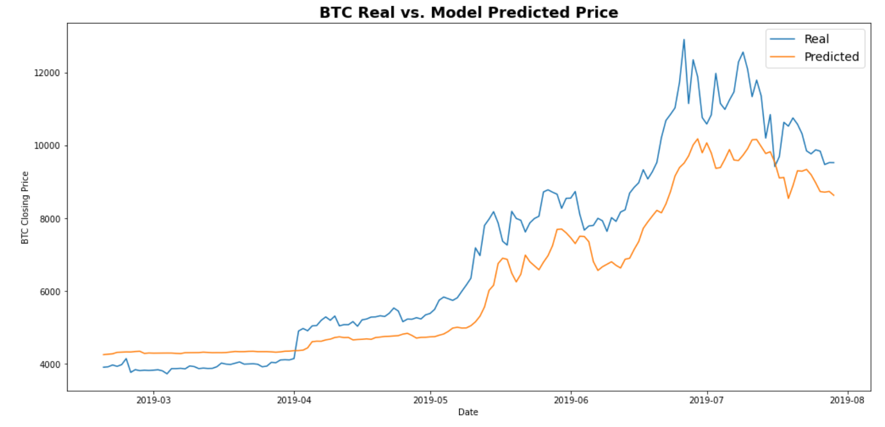
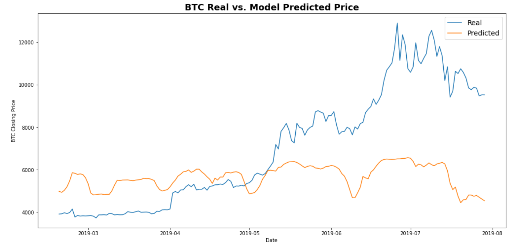
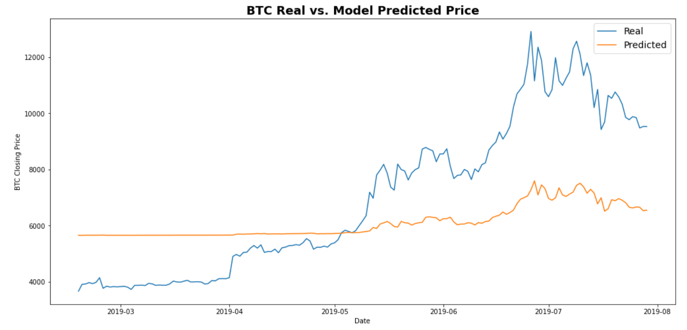
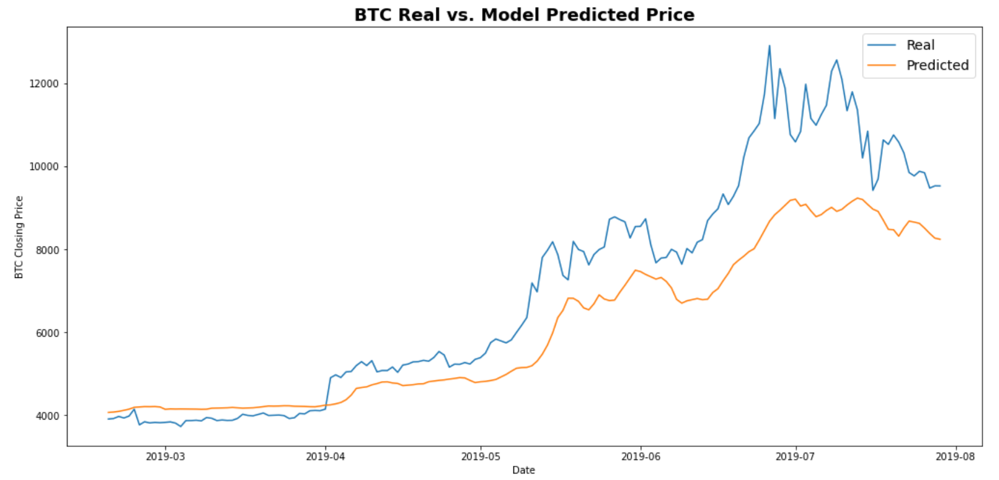
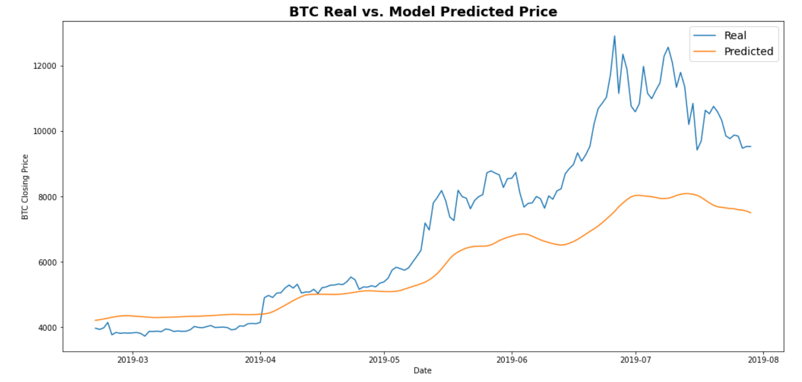

# Predicting-Closing-Prices-Using-LTSM-Recurrent-Neural-Network
This project explores using a deep learning recurrent neural networks (RNN) to model bitcoin closing prices.

## Model 1: LSTM Recurrent Neural Network using Closing Prices

***Notebook:*** [LSTM RNN Model (Closing Prices)]('lstm_stock_predictor_closing.ipynb)

In this notebook, I will build and train a custom LSTM RNN that uses a 10 day window of Bitcoin closing prices to predict the 11th day closing price. 

### Process:

1. Data Prepartion
2. Build and train a custom LSTM RNN using closing BTC prices
3. Evaluate the performance of the model

### Model Evaluation:

Below is a chart of the actual BTC price chart (blue line) vs the predicted prices from the LSTM RNN model (orange line). 

## Model 2: LSTM Recurrent Neural Network using Fear and Greed Values

***Notebook:*** [LSTM RNN Model (FNG Values)]('lstm_stock_predictor_fng.ipynb)

In this notebook, I will build and train a custom LSTM RNN that uses a 10 day window of Fear and Greed Values (FNG values) to predict the 11th day closing price of BTC. 

### Process:

1. Data Prepartion
2. Build and train a custom LSTM RNN using FNG values
3. Evaluate the performance of the model

### Model Evaluation:

Below is a chart of the actual BTC price chart (blue line) vs the predicted prices from the LSTM RNN model (orange line). 

## Model Comparison:

***Which model has a lower loss?***

Model 1 had a lower loss between the two models.
Model 1 loss =  0.017633771523833275
Model 2 loss = 0.09806384146213531

***Which model tracks the actual values better over time?***

As clearly seen in the price charts above, Model 1 tracked the real price of Bitcoin much better. Although as the price of Bitcoin accelerated upwards the model struggled to accurately track the price, the general trend of BTC was generally captured by the model. Model 2 (using the FNG values), on the other hand, didn't capture the real price movement very much at all. This appears to indicate the lagged values of the Fear and Greed index (FNG values) had little predictive value.

***Which window size works best for the model?***

I found the optimal window size was 3. Below is a few example charts of different window sizes for Model 1. This clearly demonstrates that a window size of 3 best tracked the actual price changes in BTC and the sensitivity of the model to different window sizes.

### Window Size = 1

### Window Size = 5

### Window Size = 10

### Window Size = 3 (The final chosen window size)

